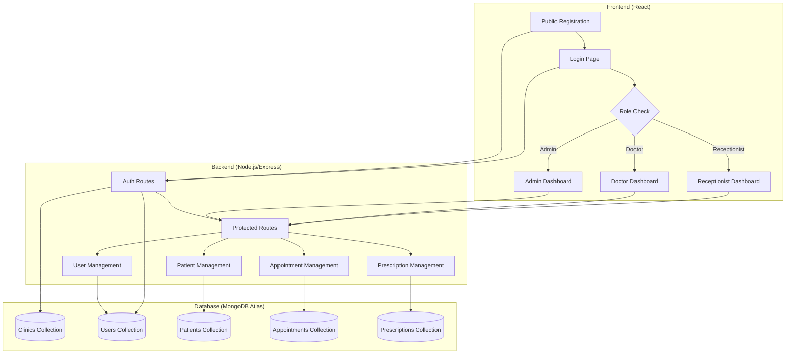

# Design Document

## Overview

The Clinic ERP System is a full-stack web application built with Node.js/Express backend and React frontend. It implements a multi-tenant architecture where each clinic operates independently with secure data isolation. The system uses JWT-based authentication with role-based access control (RBAC) to ensure users can only access appropriate features and data.

## Architecture

### System Architecture



### Technology Stack

**Backend:**
- Node.js with Express.js framework
- MongoDB Atlas with Mongoose ODM
- JWT for authentication
- bcrypt for password hashing
- express-validator for input validation
- cors for cross-origin requests

**Frontend:**
- React (JavaScript)
- React Router DOM for routing
- Tailwind CSS for styling
- Axios for HTTP requests
- Context API for state management

## Components and Interfaces

### Backend API Endpoints

#### Authentication Routes
- `POST /auth/register-clinic` - Register new clinic with custom clinic ID
- `GET /auth/check-clinic-id/:clinicId` - Check clinic ID availability and validation
- `POST /auth/login` - User login with clinicId

#### User Management Routes (Admin only)
- `POST /users` - Create new user (doctor/receptionist)
- `GET /users` - Get all clinic staff

#### Patient Management Routes
- `POST /patients` - Add new patient
- `GET /patients` - Get all clinic patients
- `GET /patients/:id` - Get specific patient
- `PUT /patients/:id` - Update patient information

#### Appointment Management Routes
- `POST /appointments` - Book new appointment
- `GET /appointments` - Get appointments (filtered by role)
- `GET /appointments/:id` - Get specific appointment
- `PUT /appointments/:id` - Update appointment

#### Prescription Management Routes
- `POST /prescriptions` - Create new prescription
- `GET /prescriptions` - Get prescriptions (filtered by role)
- `GET /patients/:id/prescriptions` - Get patient prescriptions

### Frontend Components

#### Public Components
- `ClinicRegistration` - Clinic registration form with custom clinic ID selection and real-time availability checking
- `Login` - Login form with clinicId field

#### Admin Components
- `AdminDashboard` - Main admin interface
- `CreateUser` - User creation form
- `StaffList` - Display clinic staff

#### Doctor Components
- `DoctorDashboard` - Doctor main interface
- `AppointmentList` - View assigned appointments
- `CreatePrescription` - Prescription creation form

#### Receptionist Components
- `ReceptionistDashboard` - Receptionist main interface
- `PatientForm` - Add/edit patient form
- `PatientList` - Display clinic patients
- `AppointmentForm` - Book appointment form

#### Shared Components
- `ProtectedRoute` - Route protection with role checking
- `Sidebar` - Role-based navigation sidebar with user info and logout
- `Navbar` - Navigation component
- `LoadingSpinner` - Loading indicator

## Data Models

### Clinic Schema
```javascript
{
  clinicId: { 
    type: String, 
    unique: true, 
    required: true,
    // User-defined alphanumeric ID (3-20 characters)
    validate: {
      validator: function(v) {
        return /^[a-zA-Z0-9]{3,20}$/.test(v);
      },
      message: 'Clinic ID must be 3-20 alphanumeric characters'
    }
  },
  name: { type: String, required: true },
  address: { type: String, required: true },
  contactInfo: { type: String, required: true },
  createdAt: { type: Date, default: Date.now }
}
```

### User Schema
```javascript
{
  clinicId: { type: String, required: true, index: true },
  name: { type: String, required: true },
  email: { type: String, required: true, lowercase: true },
  passwordHash: { type: String, required: true },
  role: { 
    type: String, 
    enum: ['clinic_admin', 'doctor', 'receptionist'], 
    required: true 
  },
  createdAt: { type: Date, default: Date.now }
}
```

### Patient Schema
```javascript
{
  clinicId: { type: String, required: true, index: true },
  patientId: { type: String, unique: true, required: true },
  name: { type: String, required: true },
  age: { type: Number, required: true },
  gender: { type: String, enum: ['male', 'female', 'other'] },
  contactInfo: { type: String, required: true },
  address: { type: String },
  medicalHistory: { type: String },
  createdAt: { type: Date, default: Date.now }
}
```

### Appointment Schema
```javascript
{
  clinicId: { type: String, required: true, index: true },
  appointmentId: { type: String, unique: true, required: true },
  patientId: { type: String, required: true },
  doctorId: { type: String, required: true },
  date: { type: Date, required: true },
  time: { type: String, required: true },
  status: { 
    type: String, 
    enum: ['scheduled', 'completed', 'cancelled'], 
    default: 'scheduled' 
  },
  notes: { type: String },
  createdAt: { type: Date, default: Date.now }
}
```

### Prescription Schema
```javascript
{
  clinicId: { type: String, required: true, index: true },
  prescriptionId: { type: String, unique: true, required: true },
  patientId: { type: String, required: true },
  doctorId: { type: String, required: true },
  medications: [{
    name: { type: String, required: true },
    dosage: { type: String, required: true },
    frequency: { type: String, required: true },
    duration: { type: String, required: true }
  }],
  notes: { type: String },
  createdAt: { type: Date, default: Date.now }
}
```

## Error Handling

### Backend Error Handling
- Global error middleware for consistent error responses
- Input validation using express-validator
- Database error handling with appropriate HTTP status codes
- JWT token validation and expiration handling

### Error Response Format
```javascript
{
  success: false,
  message: "Error description",
  errors: ["Detailed error messages"],
  statusCode: 400
}
```

### Frontend Error Handling
- Global error boundary component
- Form validation with user-friendly messages
- Network error handling with retry mechanisms
- Loading states and error displays

## Testing Strategy

### Backend Testing
- Unit tests for individual functions and middleware
- Integration tests for API endpoints
- Database connection and query testing
- Authentication and authorization testing
- Input validation testing

### Frontend Testing
- Component unit tests using React Testing Library
- Integration tests for user workflows
- Form validation testing
- Route protection testing
- API integration testing

### Test Coverage Areas
- User registration and authentication flows
- Role-based access control
- CRUD operations for all entities
- Data isolation between clinics
- Error handling scenarios
- Input validation and sanitization

## Security Considerations

### Authentication & Authorization
- JWT tokens with appropriate expiration times
- Password hashing using bcrypt with salt rounds
- Role-based access control middleware
- Clinic data isolation through clinicId filtering

### Data Protection
- Input sanitization and validation
- SQL injection prevention through Mongoose
- XSS protection through proper data handling
- CORS configuration for allowed origins

### API Security
- Rate limiting on authentication endpoints
- Request size limits
- Secure headers configuration
- Environment variable protection for secrets

## Deployment Architecture

### Backend Deployment
- Node.js application hosted on cloud platform
- Environment variables for database connection and JWT secrets
- MongoDB Atlas for database hosting
- API documentation using Swagger/OpenAPI

### Frontend Deployment
- React build deployed to CDN or static hosting
- Environment variables for API endpoints
- Responsive design for mobile compatibility
- Progressive Web App capabilities

## Performance Considerations

### Database Optimization
- Proper indexing on clinicId for multi-tenant queries
- Compound indexes for frequently queried fields
- Connection pooling for database connections
- Query optimization for large datasets

### Frontend Optimization
- Code splitting for route-based loading
- Lazy loading of components
- Caching strategies for API responses
- Optimized bundle sizes with tree shaking